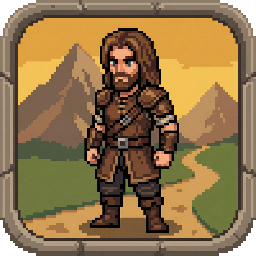

<div align="center">
  

  # 🌙 Aventura en Terra Luna
  
  **¡Ayuda a Edward a convertirse en el héroe que su aldea necesita!**

  [](https://godotengine.org)
  [](#)
  [](#)
  [](https://gabriel11730.itch.io/aventura-en-terra-luna)

  <p align="center">
    <a href="#sobre-el-juego">Sobre el Juego</a> •
    <a href="#mecánicas-principales">Mecánicas</a> •
    <a href="#tecnologías">Tecnologías</a> •
    <a href="#instalación">Instalación</a> •
    <a href="#créditos">Créditos</a>
  </p>
</div>

---

## 📖 Sobre el Juego
**Aventura en Terra Luna** es un juego de plataformas 2D con una historia y un ambiente medieval. Controlas a **Edward**, un joven que no destaca por su fuerza o valentía, pero que debe emprender un viaje hacia una cueva lejana para recuperar un libro mágico y salvar a su aldea de un tirano.

## ✨ Características Principales
- **Modo Historia:** Una aventura para encontrar el "Libro Mágico" y descubrir el verdadero valor de Edward.
- **Minijuegos Competitivos:** Desafía tus habilidades para escalar en la tabla de clasificaciones global.
- **Sistema de Progresión:** Desbloquea habilidades esenciales como el Dash y el Doble Salto.
- **Ambientación:** Paisajes naturales que evolucionan hacia cuevas antiguas y bibliotecas perdidas.

## 🕹️ Mecánicas de Juego
- 🗡️ **Combate:** Sistema de ataque con espada para derrotar orcos, lobos, serpientes y arañas.
- 💨 **Movilidad:** Dash y Doble Salto para superar desafíos ambientales.
- 💎 **Coleccionables:** Recolección de monedas y gestión de salud (corazones).
- 💾 **Sistema de Guardado:** Persistencia de datos para no perder el progreso en la historia.

## 🛠️ Tecnologías
Este proyecto ha sido desarrollado utilizando:
- **Motor:** [Godot Engine 4.x](https://godotengine.org)
- **Lenguaje:** GDScript
- **Backend de Puntuaciones:** [SilentWolf](https://silentwolf.com) (Integración para Leaderboards y Auth)
- **Plataformas compatibles:** Android y PC.

## 🎮 Controles
| Acción | Teclado | Mando |
| :--- | :--- | :--- |
| **Moverse** | Flechas / WASD | Stick Izquierdo |
| **Saltar** | Espacio / Z | Botón A |
| **Atacar** | X / J | Botón X |
| **Dash** | C / K | Botón B |
| **Pausa** | Esc | Start |

## 🚀 Instalación y Desarrollo
Si deseas explorar el código o compilar el proyecto:

1. Clona este repositorio:
   ```bash
   git clone [https://github.com/tu-usuario/aventura-en-terra-luna.git](https://github.com/tu-usuario/aventura-en-terra-luna.git)
   ```
